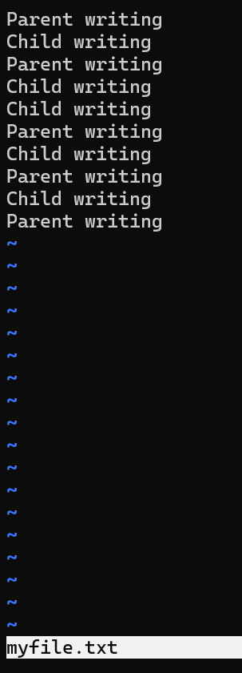

# Assignment: Practicing the Process API
Practicing with fork, exec, wait. 

### Overview

In this assignment, you will practice using the Process API to create processes and run programs under Linux. The goal is to gain hands-on experience with system calls related to process management. Specifically, you will practice using the unix process API functions 'fork()', 'exec()', 'wait()', and 'exit()'. 

⚠️ Note: This is not an OS/161 assignment. You will complete it directly on Linux. 

Use the Linux in your CSE4001 container. If you are using macOS, you may use the Terminal (you may need to install development tools with C/C++ compilers). 

**Reference Reading**: Arpaci-Dusseau, *Operating Systems: Three Easy Pieces*, Chapter 5 (Process API Basics)
 👉 [Chapter 5 PDF](http://pages.cs.wisc.edu/~remzi/OSTEP/cpu-api.pdf)

---

### **Steps to Complete the Assignment**

1. **Accept the GitHub Classroom Invitation**
    [GitHub Link](https://classroom.github.com/a/FZh4BrQG)
2. **Set up your Repository**
   - Clone the assignment repository.
3. **Study the Reference Materials**
   - Read **Chapter 5**.
   - Download and explore the sample programs from the textbook repository:
      [OSTEP CPU API Code](https://github.com/remzi-arpacidusseau/ostep-code/tree/master/cpu-api).
4. **Write Your Programs**
   - Adapt the provided example code to answer the assignment questions.
   - Each program should be clear, well-commented, and compile/run correctly.
   - Add your solution source code to the repository.

5. **Prepare Your Report**
   - Answer the questions in the README.md file. You must edit the README.md file and not create another file with the answers. 
   - For each question:
     - Include your **code**.
     - Provide your **answer/explanation**.
6. **Submit Your Work via GitHub**
   - Push both your **program code** to your assignment repository.
   - This push will serve as your submission.
   - Make sure all files, answers, and screenshots are uploaded and rendered properly.


---
### Questions
1. Write a program that calls `fork()`. Before calling `fork()`, have the main process access a variable (e.g., x) and set its value to something (e.g., 100). What value is the variable in the child process? What happens to the variable when both the child and parent change the value of x?

*The value of the variable, x, in the child process is 100, since the program sets it to 100 before the fork call. Then, when both parent and child add different numbers to them after the fork, the total value for each of them is different since both processes get their own memory space and copy of the initial value of x.*

```cpp
#include <stdio.h>
#include <stdlib.h>
#include <unistd.h>

int main(int argc, char *argv[])
{
    //print the process id
    printf("hello world (pid:%d)\n", (int) getpid());
    
    //create a variable x and set it to 100
    int x = 100;
    
    //fork the current process
    int rc = fork();
    
    //check status of fork
    if (rc < 0) {
        // fork failed; exit
        fprintf(stderr, "fork failed\n");
        exit(1);
    } else if (rc == 0) {
        // child (new process)
        printf("hello, I am child (pid:%d)\n", (int) getpid());

	//add 5 to x and print its value
	x += 5;
	printf("x is %d\n", x);
    } else {
        // parent goes down this path (original process)
        printf("hello, I am parent of %d (pid:%d)\n",
	       rc, (int) getpid());

	//add a different amount to x and print, say 7
	x += 7;
        printf("x is %d\n", x);
    }

    //exit program
    return 0;
} 
```
 


2. Write a program that opens a file (with the `open()` system call) and then calls `fork()` to create a new process. Can both the child and parent access the file descriptor returned by `open()`? What happens when they are writing to the file concurrently, i.e., at the same time?

*Yes, both the child and parent process can access the file descriptor made before the fork call. Both the parent and child can write to the file at the same time, but depending on slight timing differences and when the OS processes the write calls. You can see in the ouput that sometimes Parent writing and sometimes Child writing comes first.*

```cpp
#include <stdio.h>
#include <stdlib.h>
#include <unistd.h>
#include <fcntl.h>
#include <string.h>
#include <sys/wait.h>

int main()
{
    //open file myfile.txt and get the file descriptor
    int fd = open("myfile.txt", O_CREAT | O_WRONLY | O_TRUNC, S_IRWXU);
    if (fd < 0)
    {
        // file open failed; exit
        fprintf(stderr, "file open failed\n");
        exit(1);
    }

    //fork the process
    int rc = fork();
    if (rc < 0)
    {
        // fork failed; exit
        fprintf(stderr, "fork failed\n");
        exit(1);
    } else if (rc == 0)
    {
        // Child process
        const char *child_msg = "Child writing\n";

        //try to use the file descriptor fd and write to the file
        //concurrently with parent
        for (int i = 0; i < 5; i++)
        {
            write(fd, child_msg, strlen(child_msg));
            sleep(1);
        }
        close(fd);
    } else
    {
        // Parent process
        const char *parent_msg = "Parent writing\n";

        //try to use the file descriptor fd and write to the file
        //concurrently with parent
        for (int i = 0; i < 5; i++)
        {
            write(fd, parent_msg, strlen(parent_msg));
            sleep(1);
        }
        close(fd);
        wait(NULL);
    }
    return 0;
}
```



3. Write another program using `fork()`.The child process should print “hello”; the parent process should print “goodbye”. You should try to ensure that the child process always prints first; can you do this without calling `wait()` in the parent?

*Parent process prints after child process always by using pipe(). The child process prints and then puts some data in the write portion of fd array while parent process waits for this data to appear before printing. This always ensures child prints first since parent must wait before printing without using wait().*

```cpp
#include <stdio.h>
#include <stdlib.h>
#include <unistd.h>

int main(int argc, char *argv[])
{
    //create a buffer to fill up with what will be printed
    int fd[2];
    if (pipe(fd) == -1)
    {
	//pipe failed. exit
	fprintf(stderr, "pipe failed\n");
        exit(1);
    }

    //fork the current process
    int rc = fork();
    
    //check status of fork
    if (rc < 0) {
        // fork failed; exit
        fprintf(stderr, "fork failed\n");
        exit(1);
    } else if (rc == 0) {
	//child process
	//print goodbye
	printf("hello\n");

	//but some data in write side of fd to signal the parent
	close(fd[0]);
	write(fd[1], "x", 1);
	close(fd[1]);
    } else {
        //parent process
	//create a buffer to fill while waiting for child process to end
	close(fd[1]);
	char buf;

	//read portion of fd until child is done
	read(fd[0], &buf, 1);

        //print goodbye after child process
        printf("goodbye\n");

	close(fd[0]);
    }

    //exit program
    return 0;
} 
```


4. Write a program that calls `fork()` and then calls some form of `exec()` to run the program `/bin/ls`. See if you can try all of the variants of `exec()`, including (on Linux) `execl()`, `execle()`, `execlp()`, `execv()`, `execvp()`, and `execvpe()`. Why do you think there are so many variants of the same basic call?

*There are so many variants of the same basic call because it depends on what the program is trying to do. Sometimes, you only need a basic exec call where you specify the arguments yourself and the path of the file to be executed while other times you might need to get more specific. Being able to put arguments into an array and use that also means the program can dynamically change the contents of the array depending on some logic while the exec call looks the same. It all comes down to complexity and how specific you need the call to be.*

```cpp
#define _GNU_SOURCE
#include <stdio.h>
#include <stdlib.h>
#include <unistd.h>
#include <sys/wait.h>

int WhichProcessAmI(int rc)
{
    //check status of fork
    if (rc < 0)
    {
        // fork failed; exit
        fprintf(stderr, "fork failed\n");
        exit(1);
    }
    else if (rc == 0)
    {
        // child process
        return 0;
    }
    else
    {
        // parent process
        return 1;
    }
}

int main(int argc, char *argv[])
{
    for (int i = 0; i <= 5; i++)
    {
        // fork the current process and determine which it is 0 = child, 1 = parent
        int rc = fork();
        int type = WhichProcessAmI(rc);

        //if you're a child process, perform a different variant of exec
        //then exit
        if (type == 0)
        {
            switch (i)
            {
                case 0:
                    //first exec variant using list of args
                    execl("/bin/ls", "ls", "-l", "/root", NULL);
                    return 0;
                case 1:
                {
                    //next exec variant using argument array
                    char* args[] = { "ls", "-l", "/root", NULL };
                    execv("/bin/ls", args);
                    return 0;
                }
                case 2:
                    //next exec variant using path to find program
                    execlp("ls", "ls", "-l", "/root", NULL);
                    return 0;
                case 3:
                {
                    //next exec variant using path to find program and argument array
                    char* args[] = { "ls", "-l", "/root", NULL };
                    execvp("ls", args);
                    return 0;
                }
                case 4:
                {
                    //next exec variant using specified path variable to find program
                    //and specified environment variable in an array
                    char* envp[] = { "HOME=/home/user", "PATH=/bin:/usr/bin", NULL };
                    execle("/bin/ls", "ls", "-l", NULL, envp);
                    return 0;
                }
                case 5:
                {
                    //next exec variant using specified path variable to find program
                    //and specified environment variable in an array and an argument array
                    char* args[] = { "ls", "-l", NULL };
                    char* envp[] = { "HOME=/home/user", "PATH=/bin:/usr/bin", NULL };
                    execvpe("ls", args, envp);
                    return 0;
                }
                default:
                    return 0;
            }
        }
        else
        {
            //otherwise if youre a parent wait and continue and make more children
            wait(NULL);
        }
    }

    //exit program
    return 0;
} 
```


5. Now write a program that uses `wait()` to wait for the child process to finish in the parent. What does `wait()` return? What happens if you use `wait()` in the child?

*wait() returns the PID of the terminated child process. If you call wait in a child process, it will immediately fail and return -1 since wait() is supposed to suspend the current process until a child exits, but since a child won't have any children it will just fail.*

```cpp
#include <stdio.h>
#include <stdlib.h>
#include <unistd.h>
#include <sys/wait.h>

int main(int argc, char *argv[])
{  
    //fork the current process
    int rc = fork();
    
    //check status of fork
    if (rc < 0) {
        // fork failed; exit
        fprintf(stderr, "fork failed\n");
        exit(1);
    } else if (rc == 0) {
        // child (new process)

        //print that you're the child
        printf("child process\n");
    } else {
        // parent goes down this path (original process)

        //wait for child to end then print its pid
        //then print you're the parent
        int wc = wait(NULL);
        printf("child process PID is %d\n", wc);
        printf("parent process\n");
    }

    //exit program
    return 0;
}
```


6. Write a slight modification of the previous program, this time using `waitpid()` instead of `wait()`. When would `waitpid()` be useful?

*waitpid() would be useful when a parent process has multiple children, each with a distinct pid and the parent wants to select a specific one of those children to wait to terminate rather than just any.*

```cpp
#include <stdio.h>
#include <stdlib.h>
#include <unistd.h>
#include <sys/wait.h>

int main(int argc, char *argv[])
{  
    //fork the current process
    int rc = fork();
    
    //check status of fork
    if (rc < 0) {
        // fork failed; exit
        fprintf(stderr, "fork failed\n");
        exit(1);
    } else if (rc == 0) {
        // child (new process)

        //print that you're the child
        printf("child process\n");
    } else {
        // parent goes down this path (original process)

        //wait for child to end then print its pid
        //then print you're the parent
        int wc = waitpid(rc , NULL, 0);
        printf("child process PID is %d\n", wc);
        printf("parent process\n");
    }

    //exit program
    return 0;
}
```


7. Write a program that creates a child process, and then in the child closes standard output (`STDOUT FILENO`). What happens if the child calls `printf()` to print some output after closing the descriptor?

*Running printf() in the child process after closing the standard output, will result in no output to the screen. Doing printf() will write to the current open file stream, which by default is just the command line, so if you close it the text has nowhere to go.*

```cpp
#include <stdio.h>
#include <stdlib.h>
#include <unistd.h>
#include <string.h>
#include <fcntl.h>
#include <sys/wait.h>

int main(int argc, char *argv[])
{
    //fork the current process
    int rc = fork();

    //check the status of the current process
    if (rc < 0) {
        // fork failed; exit
        fprintf(stderr, "fork failed\n");
        exit(1);
    } else if (rc == 0) {
	// child: close the standard output
	close(STDOUT_FILENO);

	//try to print some text
	printf("child process printing\n");
    } else {
        // parent goes down this path (original process)
        //just wait and then exit
	wait(NULL);
    }
    return 0;
}
```

